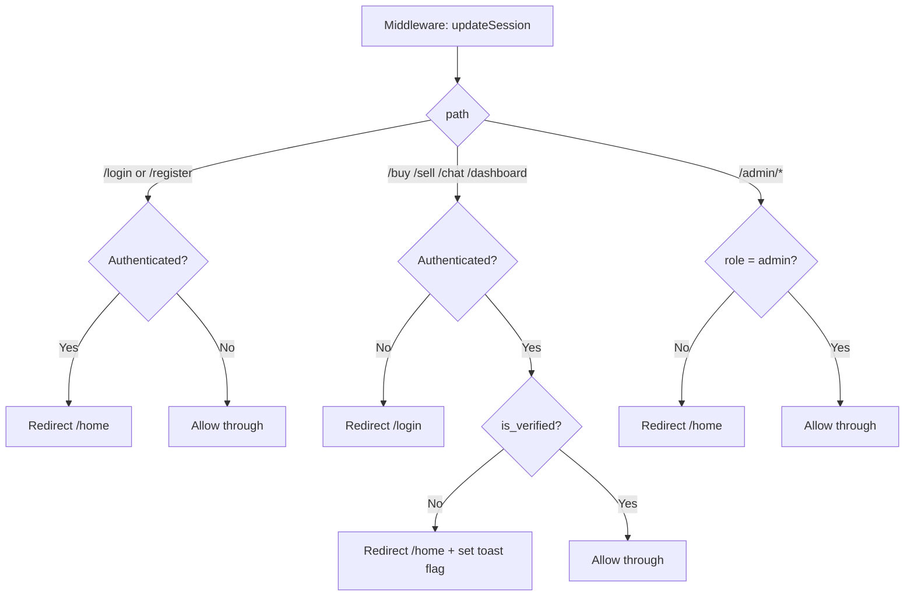
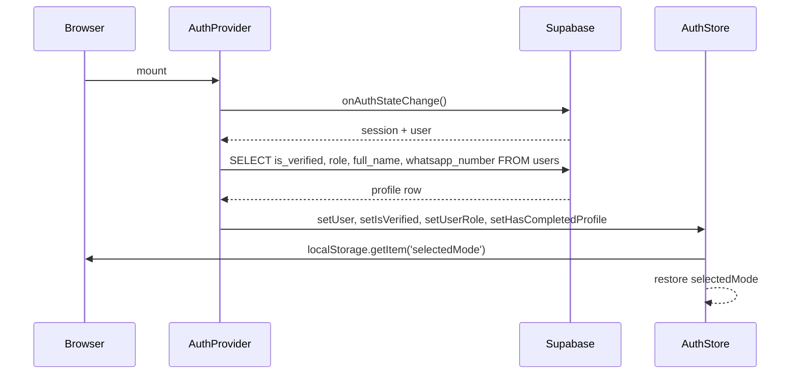

# Design Document — Home Experience & Auth Flow

## Overview

This feature transforms the post-login experience of the B2B marketplace. The central change is making `/home` the authenticated user's hub: verified users see a Buy/Sell mode toggle and discovery sections; unverified users see a locked view with a verification card. Supporting changes include a stricter middleware, an extended Zustand auth store, a reworked registration form (Full Name + WhatsApp, no role selector), avatar auto-generation, Navbar improvements, a profile verification badge, a sell-page publish guard, and a fully upgraded Admin User Management table.

The app stack is Next.js 14 (App Router), Supabase (auth + Postgres), Zustand, Tailwind CSS, TypeScript.

---

## Architecture

### High-Level Flow

```mermaid
flowchart TD
    A[User visits app] --> B{Authenticated?}
    B -- No --> C[/ landing page or /login]
    B -- Yes --> D{Admin?}
    D -- Yes --> E[/admin]
    D -- No --> F[/home]

    F --> G{is_verified?}
    G -- No --> H[Locked Home View]
    G -- Yes --> I[Full Home View]

    H --> J[Verification card + disabled toggle]
    I --> K[Mode Toggle + Discovery Sections]

    K --> L{Toggle selection}
    L -- Buy --> M[/buy]
    L -- Sell --> N[/sell]
```

### Middleware Route Guard Logic



### Auth State Data Flow



---

## Components and Interfaces

### New Files

```
app/home/
  page.tsx                  — Server component, fetches trending/recent products
  HomeClient.tsx            — Client shell: renders LockedHome or VerifiedHome
  LockedHome.tsx            — Full locked view for unverified users
  VerifiedHome.tsx          — Mode toggle + discovery sections for verified users
  TrendingSection.tsx       — Trending products grid (up to 6)
  RecentSection.tsx         — Recently added listings grid
  QuickCategories.tsx       — Category pill links → /buy?category=X
  VerificationBanner.tsx    — Top banner for unverified users

components/
  ModeToggle.tsx            — Reusable Buy/Sell sliding toggle (replaces HomeToggle logic)
  VerificationBadge.tsx     — Verified/Unverified badge with optional tooltip

app/admin/users/
  UsersTable.tsx            — Extended (already exists, needs columns + actions added)
```

### Modified Files

```
lib/supabase/middleware.ts   — Auth guard + verification gating + /login redirect
store/authStore.ts           — Extended state shape
components/AuthProvider.tsx  — Fetch isVerified, userRole, hasCompletedProfile
components/Navbar.tsx        — Home link, active state, unverified dot on Sell
app/login/page.tsx           — Full Name + WhatsApp fields, remove role selector
app/sell/page.tsx            — Unverified publish guard (popup)
app/profile/page.tsx         — VerificationBadge component
app/admin/users/UsersTable.tsx — New columns, search by name/company, WhatsApp/email actions
lib/services/adminService.ts — Extended AdminUser type
types/index.ts               — Extended User type
```

### Component Tree — `/home` Route

```
app/home/page.tsx (Server)
└── HomeClient.tsx (Client)
    ├── VerificationBanner.tsx          [unverified only]
    ├── LockedHome.tsx                  [unverified only]
    │   ├── ModeToggle.tsx (disabled)
    │   └── [blurred teaser overlay]
    └── VerifiedHome.tsx                [verified only]
        ├── ModeToggle.tsx (active)
        ├── TrendingSection.tsx
        │   └── ProductCard[] (lazy-loaded images)
        ├── QuickCategories.tsx
        └── RecentSection.tsx
            └── ProductCard[] (lazy-loaded images)
```

---

## Data Models

### `users` Table — Required Additions

The existing schema already has `is_verified`, `verification_status`, `is_blocked`, `full_name`, `avatar_url`, `roles`, `role`, `phone`, `company_name`. Two fields need to be added:

```sql
-- Migration: home_experience_migration.sql
ALTER TABLE public.users
  ADD COLUMN IF NOT EXISTS whatsapp_number text,
  ADD COLUMN IF NOT EXISTS username text;

-- Index for admin search
CREATE INDEX IF NOT EXISTS idx_users_full_name ON public.users(full_name);
CREATE INDEX IF NOT EXISTS idx_users_company_name ON public.users(company_name);
```

`is_blocked` already exists from `admin_migration.sql`. No other schema changes are required.

### Extended `User` Type (`types/index.ts`)

```typescript
export interface User {
  id: string;
  email: string;
  full_name?: string;
  username?: string;
  role: "buyer" | "seller" | "admin";
  roles?: string[];
  is_verified: boolean;
  is_subscribed: boolean;
  is_blocked: boolean;
  subscription_expiry: string | null;
  verification_status: "pending" | "approved" | "rejected";
  company_name?: string;
  phone?: string;
  whatsapp_number?: string;   // NEW
  country?: string;
  avatar_url?: string;
  created_at: string;
}
```

### Extended `AdminUser` Type (`lib/services/adminService.ts`)

```typescript
export interface AdminUser {
  id: string;
  email: string;
  full_name?: string;
  username?: string;
  role: string;
  is_verified: boolean;
  verification_status: "pending" | "approved" | "rejected";
  is_subscribed: boolean;
  subscription_expiry: string | null;
  is_blocked: boolean;
  company_name?: string;
  whatsapp_number?: string;   // NEW
  created_at: string;
}
```

### Extended Zustand Auth Store (`store/authStore.ts`)

```typescript
interface AuthState {
  user: User | null;
  isVerified: boolean;
  selectedMode: "buy" | "sell";
  userRole: string | null;
  hasCompletedProfile: boolean;
  lastVisitedPage: string | null;

  setUser: (user: User | null) => void;
  setIsVerified: (v: boolean) => void;
  setSelectedMode: (mode: "buy" | "sell") => void;
  setUserRole: (role: string | null) => void;
  setHasCompletedProfile: (v: boolean) => void;
  setLastVisitedPage: (page: string | null) => void;
}
```

`selectedMode` is initialised from `localStorage.getItem('selectedMode')` (defaulting to `"buy"`) and written back on every `setSelectedMode` call.

### Avatar Generation

Avatars are generated client-side as SVG data URIs from the user's initials at registration time. The reference is stored in `users.avatar_url`.

```typescript
// lib/utils/generateAvatar.ts
export function generateAvatarDataUri(fullName: string): string {
  const initials = fullName
    .trim()
    .split(/\s+/)
    .slice(0, 2)
    .map((w) => w[0].toUpperCase())
    .join("");
  // Returns a base64-encoded SVG circle with initials
  const svg = `<svg xmlns="http://www.w3.org/2000/svg" width="64" height="64">
    <circle cx="32" cy="32" r="32" fill="#6366f1"/>
    <text x="50%" y="50%" dominant-baseline="central" text-anchor="middle"
      font-family="sans-serif" font-size="24" fill="white">${initials}</text>
  </svg>`;
  return `data:image/svg+xml;base64,${btoa(svg)}`;
}
```

---

## Correctness Properties

*A property is a characteristic or behavior that should hold true across all valid executions of a system — essentially, a formal statement about what the system should do. Properties serve as the bridge between human-readable specifications and machine-verifiable correctness guarantees.*

### Property 1: Non-admin login redirects to /home

*For any* valid non-admin user credentials, a successful login should result in the user being redirected to `/home` and not to `/pending`, `/subscribe`, `/profile`, or `/dashboard`.

**Validates: Requirements 1.1, 1.3**

---

### Property 2: Admin login redirects to /admin

*For any* valid admin user credentials, a successful login should result in the user being redirected to `/admin`.

**Validates: Requirements 1.2**

---

### Property 3: New user record defaults

*For any* valid registration input, the resulting user record in the `users` table should have `is_verified: false`, `verification_status: "pending"`, and both `"buyer"` and `"seller"` in the `roles` array.

**Validates: Requirements 2.1, 2.3**

---

### Property 4: Registration redirects to /home

*For any* successful new user registration, the post-registration redirect target should be `/home`.

**Validates: Requirements 2.2**

---

### Property 5: Registration form rejects missing required fields

*For any* registration form submission where at least one required field (Full Name, Email, Password, WhatsApp Number) is empty or invalid, the form should reject submission and display a validation error for each missing field, leaving the user on the registration form.

**Validates: Requirements 3.1, 3.2, 3.3, 3.4, 3.7**

---

### Property 6: Password minimum length validation

*For any* password string with fewer than 6 characters, the registration form should reject it and display a validation error.

**Validates: Requirements 3.3**

---

### Property 7: Avatar initials derivation

*For any* full name string, the auto-generated avatar should contain exactly the first letter of the first word and the first letter of the second word (if present), both uppercased.

**Validates: Requirements 3.8**

---

### Property 8: Auth guard redirects authenticated users away from auth routes

*For any* authenticated user, attempting to navigate to `/login` or `/register` should result in a redirect to `/home`.

**Validates: Requirements 4.1, 4.2**

---

### Property 9: Unauthenticated users can access auth routes

*For any* unauthenticated request to `/login` or `/register`, the middleware should allow the request through without redirecting.

**Validates: Requirements 4.3**

---

### Property 10: Unverified users are blocked from gated routes

*For any* authenticated unverified user, attempting to access `/buy`, `/sell`, `/chat`, or `/dashboard` should result in a redirect to `/home`.

**Validates: Requirements 5.1, 5.2, 5.3, 5.4**

---

### Property 11: Verified users have full access to gated routes

*For any* authenticated verified user, accessing `/buy`, `/sell`, `/chat`, or `/dashboard` should be allowed through by the middleware without redirection.

**Validates: Requirements 5.6**

---

### Property 12: Unauthenticated users are redirected to /login from protected routes

*For any* unauthenticated request to a protected route (`/buy`, `/sell`, `/chat`, `/dashboard`, `/profile`), the middleware should redirect to `/login`.

**Validates: Requirements 5.7**

---

### Property 13: Home page renders locked view for unverified users

*For any* authenticated unverified user, the `/home` page should render the `LockedHome` component and the `VerificationBanner`, and should not render the `VerifiedHome` component.

**Validates: Requirements 6.1, 6.6**

---

### Property 14: Home page renders full view for verified users

*For any* authenticated verified user, the `/home` page should render the `VerifiedHome` component with the mode toggle and discovery sections, and should not render the `LockedHome` component or `VerificationBanner`.

**Validates: Requirements 6.7, 7.1**

---

### Property 15: Mode toggle selectedMode persists and restores

*For any* mode selection (`"buy"` or `"sell"`), after calling `setSelectedMode`, reading `localStorage.getItem('selectedMode')` should return the same value; and after a store re-initialisation, `selectedMode` should equal the value previously stored in `localStorage`.

**Validates: Requirements 7.10, 7.11, 11.3, 11.4**

---

### Property 16: Unverified users cannot publish listings

*For any* unverified user who submits the sell form, the submission should be blocked (no product inserted with `is_active: true`) and a popup should be displayed.

**Validates: Requirements 8.1**

---

### Property 17: Verified users publish listings as active

*For any* verified user who submits a valid listing form, the resulting product record should have `is_active: true`.

**Validates: Requirements 8.2**

---

### Property 18: Navbar active state matches current route

*For any* route that corresponds to a Navbar link, the matching link should have the active visual style applied, and no other link should have that style.

**Validates: Requirements 9.3**

---

### Property 19: Unverified dot indicator on Sell link

*For any* authenticated unverified user, the Navbar's "Sell" link should render with the indicator dot element present in the DOM.

**Validates: Requirements 9.4**

---

### Property 20: Profile page verification badge reflects status

*For any* authenticated user, the profile page should render a badge whose text is "Verified" when `is_verified` is `true` and "Unverified" when `is_verified` is `false`.

**Validates: Requirements 10.4, 10.5**

---

### Property 21: Auth store reflects database verification state

*For any* auth state change event, the `isVerified`, `userRole`, and `hasCompletedProfile` fields in the Auth Store should match the corresponding values in the `users` table row for that user.

**Validates: Requirements 11.2**

---

### Property 22: Trending section shows at most 6 products

*For any* set of products in the database, the Trending Products section on the home page should display at most 6 items.

**Validates: Requirements 12.1**

---

### Property 23: Recent listings are ordered by creation date descending

*For any* set of active products, the Recently Added Listings section should display them in descending `created_at` order.

**Validates: Requirements 12.3**

---

### Property 24: Non-admin users cannot access /admin/users

*For any* non-admin user (including unauthenticated users), attempting to access `/admin/users` should result in a redirect to `/home` or `/login`.

**Validates: Requirements 13.1, 13.12**

---

### Property 25: Admin user search filters correctly

*For any* search query string, all users returned by the admin search should have the query string present in at least one of: `full_name`, `email`, or `company_name` (case-insensitive).

**Validates: Requirements 13.3, 13.4**

---

### Property 26: Verify/unverify round-trip

*For any* user, applying "Mark as Verified" followed by "Mark as Unverified" should result in `is_verified: false` and `verification_status: "pending"` — restoring the original unverified state.

**Validates: Requirements 13.6, 13.7**

---

### Property 27: Suspend/activate round-trip

*For any* user, applying "Suspend Account" followed by "Activate Account" should result in `is_blocked: false` — restoring the original active state.

**Validates: Requirements 13.8, 13.9**

---

## Error Handling

### Middleware Errors

- If the Supabase client fails to resolve the session (network error, misconfigured env vars), the middleware falls through with `NextResponse.next()` — it does not block the request. This matches the existing `try/catch` pattern.
- If the `users` table query fails during verification check, the middleware should treat the user as unverified and redirect to `/home` rather than crashing.

### Registration Errors

- Supabase `signUp` errors (duplicate email, weak password) are caught and displayed as toast messages.
- If the `users` upsert after sign-up fails, the auth account still exists. The app should handle a missing profile row gracefully (treat as unverified, prompt to complete profile).
- WhatsApp number format validation is done client-side with a regex (`/^\+?[1-9]\d{6,14}$/`) before submission.

### Avatar Generation Errors

- Avatar generation is synchronous and pure (SVG string → base64). It cannot fail for any non-empty string input.
- If `full_name` is empty at generation time, fall back to the first character of the email local part.

### Home Page Data Fetching

- Trending and Recent sections use `try/catch` around Supabase queries. On error, the section renders an empty state rather than crashing the page.
- Skeleton UI is shown while `loading` is `true`; if the fetch errors, the skeleton is replaced with an empty state message.

### Sell Page Publish Guard

- The unverified check reads `isVerified` from the Zustand store (already populated by `AuthProvider`). No additional network call is needed at submit time.
- If the store value is stale (e.g., user was just verified in another tab), the server-side insert will still succeed because the middleware already allowed the user through to `/sell`. The guard is a UX layer, not a security layer — the RLS policy on `products` is the authoritative gate.

### Admin Actions

- All admin PATCH calls return structured `{ error }` JSON on failure. `UsersTable` catches these and shows a toast.
- Optimistic UI updates are rolled back on error by re-fetching or reverting the local state.

---

## Testing Strategy

### Dual Testing Approach

Both unit tests and property-based tests are required. Unit tests cover specific examples, integration points, and edge cases. Property-based tests verify universal correctness across randomised inputs.

### Unit Tests

Focus areas:
- `generateAvatarDataUri`: specific name inputs → expected initials in SVG output
- `middleware.ts`: specific route + auth state combinations → expected redirect or pass-through
- `LockedHome` / `VerifiedHome` rendering: snapshot tests for key UI elements
- Registration form: specific invalid inputs → specific error messages
- `UsersTable` search: specific query strings → filtered results

### Property-Based Tests

Use **fast-check** (TypeScript-native PBT library). Each test runs a minimum of **100 iterations**.

Each test is tagged with a comment in the format:
`// Feature: home-experience-auth-flow, Property N: <property text>`

**Property test targets:**

| Property | Test Description | fast-check Generators |
|---|---|---|
| P1 | Non-admin login → /home | `fc.record({ email, password })` for non-admin users |
| P3 | New user record defaults | `fc.record({ fullName, email, password, whatsapp })` |
| P5 | Form rejects missing required fields | `fc.record` with arbitrary missing fields |
| P6 | Password < 6 chars rejected | `fc.string({ maxLength: 5 })` |
| P7 | Avatar initials derivation | `fc.string()` for full names |
| P8 | Auth guard: authenticated → /home | `fc.record` for authenticated user sessions |
| P10 | Unverified blocked from gated routes | `fc.constantFrom('/buy', '/sell', '/chat', '/dashboard')` |
| P11 | Verified allowed through | Same route generator, verified user |
| P15 | selectedMode localStorage round-trip | `fc.constantFrom('buy', 'sell')` |
| P16 | Unverified cannot publish | Unverified user + valid listing form data |
| P18 | Navbar active state | `fc.constantFrom` of all nav routes |
| P22 | Trending ≤ 6 products | `fc.array(productArb, { minLength: 0, maxLength: 50 })` |
| P23 | Recent listings ordered by date | `fc.array(productArb)` with random `created_at` values |
| P25 | Admin search filters correctly | `fc.string()` query + `fc.array(userArb)` |
| P26 | Verify/unverify round-trip | `fc.record` for any user |
| P27 | Suspend/activate round-trip | `fc.record` for any user |

### Test File Locations

```
__tests__/
  unit/
    generateAvatar.test.ts
    middleware.test.ts
    registrationValidation.test.ts
  property/
    authFlow.property.test.ts      — P1, P2, P3, P4, P8, P9, P10, P11, P12
    homeExperience.property.test.ts — P13, P14, P15, P22, P23
    sellGuard.property.test.ts     — P16, P17
    adminUsers.property.test.ts    — P24, P25, P26, P27
    avatar.property.test.ts        — P7
    formValidation.property.test.ts — P5, P6
```

### Property Test Configuration Example

```typescript
// Feature: home-experience-auth-flow, Property 7: Avatar initials derivation
import * as fc from "fast-check";
import { generateAvatarDataUri } from "@/lib/utils/generateAvatar";

test("avatar contains correct initials for any full name", () => {
  fc.assert(
    fc.property(
      fc.array(fc.string({ minLength: 1 }), { minLength: 1, maxLength: 5 })
        .map((words) => words.join(" ")),
      (fullName) => {
        const svg = atob(generateAvatarDataUri(fullName).split(",")[1]);
        const words = fullName.trim().split(/\s+/);
        const expectedInitials = words
          .slice(0, 2)
          .map((w) => w[0].toUpperCase())
          .join("");
        return svg.includes(expectedInitials);
      }
    ),
    { numRuns: 100 }
  );
});
```
